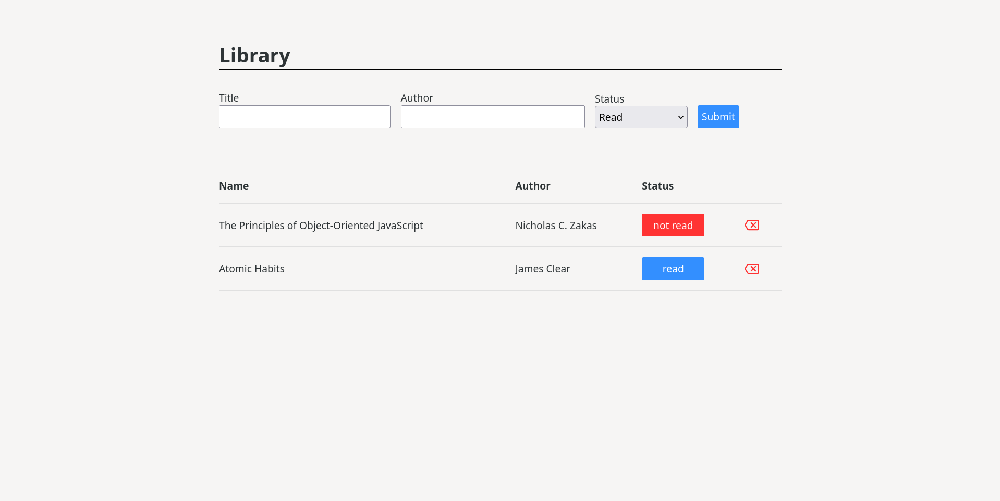

# my-Library

my-library is a very simple app to orgnize books by adding them to my-library and then modify them(remove or change their status).

the project is a solution for [The Odin Project](https://www.theodinproject.com).

[live preview](https://www.rahhaly.github.io/library).

